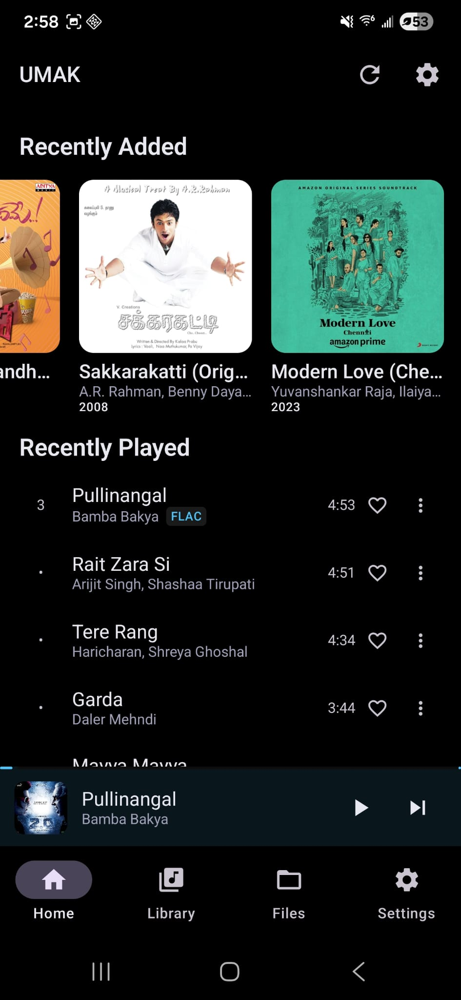
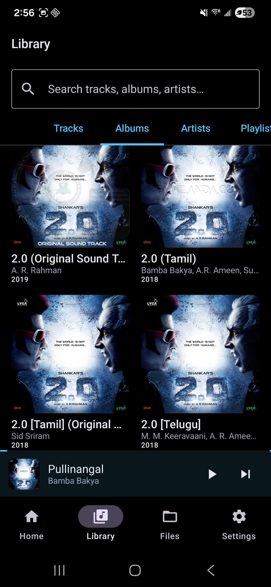
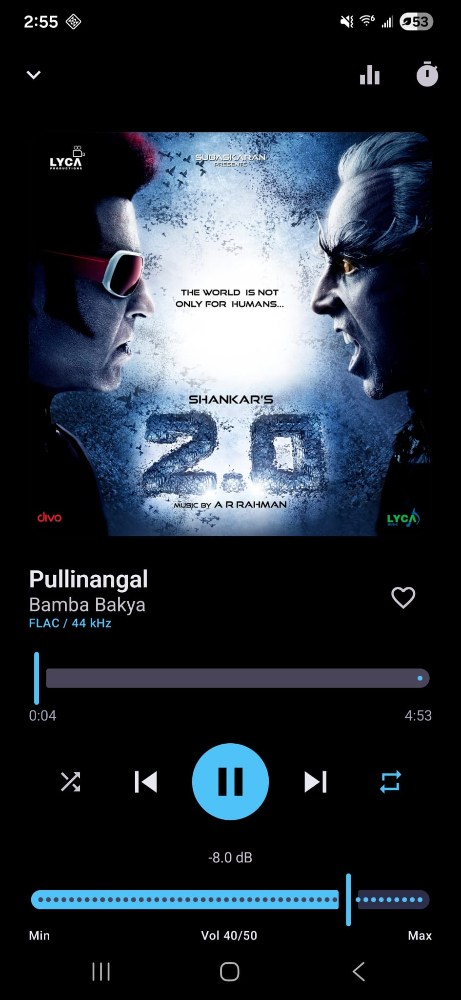
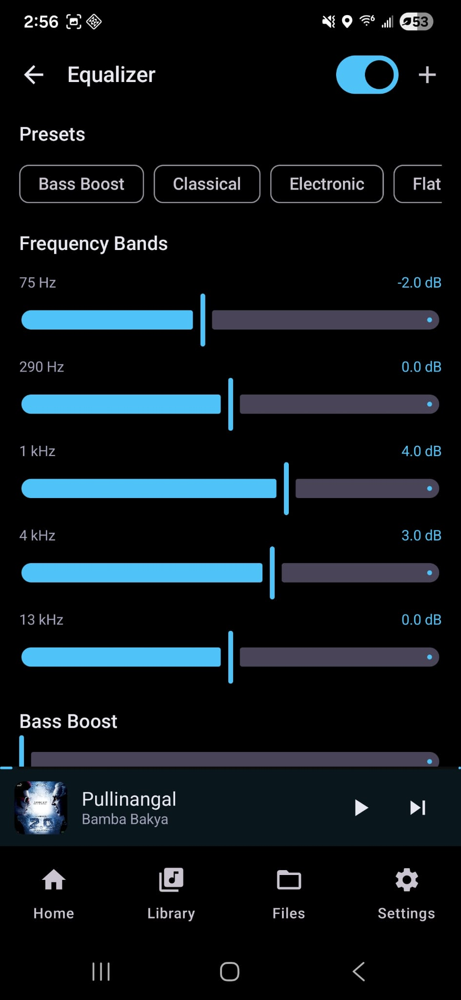
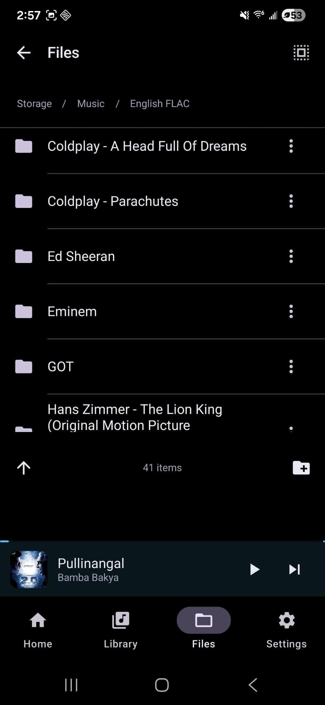
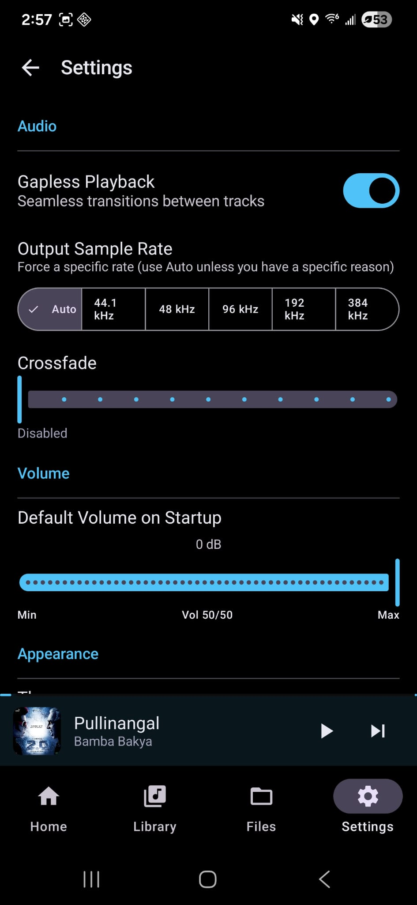

# UMAK

A personal **UMAK** music player for Android (Kotlin, Jetpack Compose, Media3 ExoPlayer) with a hardware-backed equalizer, library management, and optional file-level tagging. The project was built with a session-based workflow; the full product specification and agent conversation exports live in this repository so you can reproduce the design and implementation context.

---

## Screenshots

| Home | Library | Now Playing |
|------|---------|-------------|
|  |  |  |

| Equalizer | File Explorer | Settings |
|-----------|---------------|----------|
|  |  |  |

---

## Highlights and how they work

### Hardware-level equalizer and AudioFX

Android exposes DSP effects through [`android.media.audiofx`](https://developer.android.com/reference/android/media/audiofx/package-summary). This app attaches **`Equalizer`**, **`BassBoost`**, **`Virtualizer`**, and **`LoudnessEnhancer`** to the **same audio session** ExoPlayer uses, so filtering runs on the device audio path (HAL / codec DSP), not as a separate software mixer inside the UI.

**Session wiring**

1. `MusicPlayerService` builds ExoPlayer with media-focused `AudioAttributes` and `handleAudioFocus = true`, and `setHandleAudioBecomingNoisy(true)` for headphone unplug behavior.
2. When playback reaches `STATE_READY`, ExoPlayer’s `audioSessionId` is copied into **MediaSession extras** (`audioSessionId` key).
3. `PlayerController` (Hilt singleton) connects a **Media3 `MediaController`** to that session, listens for `onExtrasChanged`, and waits until the session ID is non-zero.
4. `attachAudioEffects(sessionId)` constructs `Equalizer(0, sessionId)`, `BassBoost`, `Virtualizer`, and `LoudnessEnhancer` with that ID. Priority `0` is the normal attach priority for the global output mix.

**EQ UI vs hardware**

- `EqualizerViewModel` reads **`numberOfBands`**, **`bandLevelRange`**, and per-band center/range from the live `Equalizer` instance (e.g. five bands on many Qualcomm devices), so sliders match what the codec actually exposes.
- Moving a slider calls **`setBandLevel(short band, short levelMillibels)`** immediately so changes are audible during playback.
- Built-in and custom presets are stored in **Room** (`EqPreset`); applying a preset pushes band levels and effect strengths through `PlayerController`.

More detail, preset tables in millibels, and device notes are in [`SPEC.md`](SPEC.md) (sections **5–6**).

### Fine-grained volume (50 steps) and ReplayGain

System media volume has coarse steps. The app maps a **1–50 UI level** to a **linear gain** applied via **`ExoPlayer.setVolume()`** using a perceptual curve:

\[
\text{gain} = 10^{(L - 50) \times 0.04}
\]

implemented in `VolumeUtil.levelToGain()` (see [`SPEC.md` §7](SPEC.md) for the dB table). Level and shuffle/repeat preferences persist in **DataStore**.

When a track has **ReplayGain** metadata, the scanner reads it (`MediaStoreScanner` / tag path); `PlayerController.applyVolume()` combines **ReplayGain (dB → linear)** with the user level so normalization stacks multiplicatively on the same ExoPlayer gain stage.

### Playback and background controls

- **Media3** `ExoPlayer` + **`MediaSessionService`** provide lock-screen and notification transport controls and session lifecycle integration.
- Queue and navigation from UI go through **`PlayerController`**, which hides the `MediaController` from individual ViewModels.

### Library and storage

- **Room** holds tracks, albums, artists, playlists, and EQ presets; **WorkManager** triggers library scans (`MusicRepository.scanLibrary()`).
- **MediaStore**-backed scanning with optional **JAudioTagger** for writing tags from the file explorer flow (see spec for permissions such as `READ_MEDIA_AUDIO`, notifications, and optional broad storage for file management).

### UI stack

- **Jetpack Compose** + **Material 3**, **Navigation-Compose**, **Hilt** for DI, **Coil** for artwork, **Accompanist Permissions** for runtime permission UX.

---

## Tech stack (summary)

| Layer | Choices |
|-------|---------|
| Language | Kotlin 2.x, JVM 17 |
| UI | Compose, Material 3 |
| DI | Hilt |
| DB | Room (KSP) |
| Playback | Media3 ExoPlayer + MediaSession |
| Async | Kotlin coroutines, Flow, DataStore |
| Images | Coil |
| Background work | WorkManager |
| Tags | JAudioTagger (where used) |

Exact versions live in [`gradle/libs.versions.toml`](gradle/libs.versions.toml).

---

## Building and running

**Requirements**

- **Android Studio** (Ladybug or newer recommended) with **Android SDK** installed (project targets **compileSdk 35**, **minSdk 33**).
- **JDK 17** (matches Gradle `jvmTarget` / `JavaVersion.VERSION_17`).

**Steps**

1. Clone the repository.
2. Open the project root in Android Studio (the folder that contains `settings.gradle.kts`).
3. Let Gradle sync. Create `local.properties` with `sdk.dir=...` if the IDE does not generate it (this file is gitignored).
4. Run the **`app`** configuration on a **physical device or emulator API 33+**.

Debug builds use `applicationIdSuffix = ".debug"` (`com.musicplayer.debug`).

---

## Documentation and history in this repo

| File / folder | Purpose |
|---------------|---------|
| [`SPEC.md`](SPEC.md) | Full app specification: architecture, every screen, audio engine, EQ math, DB schema, permissions, dependencies, roadmap. |
| [`SESSIONS.md`](SESSIONS.md) | Ordered **Cursor session prompts** used to build the app incrementally; handy to continue work in a fresh agent chat. |
| [`ConversationHistory/`](ConversationHistory/) | Exported **Cursor agent transcripts** (JSONL) plus [`ConversationHistory/INDEX.txt`](ConversationHistory/INDEX.txt), which lists sessions in chronological order. |

Together, SPEC + sessions + transcripts are meant to reproduce **what** was built and **how** the implementation was driven in the IDE.

---

## Project layout (source)

```
app/src/main/java/com/musicplayer/
├── di/                 Hilt modules
├── data/               Room, MediaStore scanner, repositories
├── domain/model/       Domain models
├── service/            MusicPlayerService, PlayerController
├── ui/                 Compose screens, navigation, theme
└── util/               VolumeUtil, AudioFormatUtil, etc.
```

---

## License

Add a `LICENSE` file if you plan to publish this publicly; the repository does not ship a default license.
